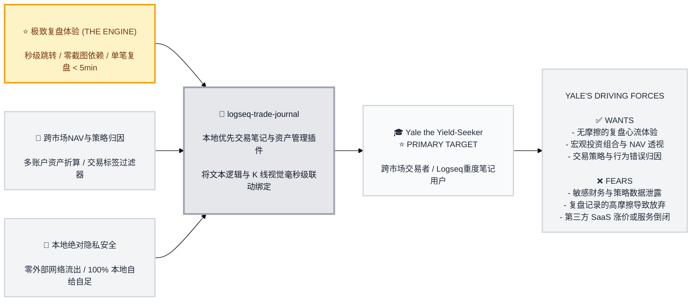

# Trigger Map Poster: logseq-trade-journal

> Visual overview connecting business goals to user psychology

**Created:** 2026-05-21
**Author:** Yale
**Methodology:** Based on Effect Mapping (Balic & Domingues), adapted for WDS framework

---

## Strategic Documents

This is the visual overview of the Trigger Map. For detailed documentation on each component, see:

- **[01-Business-Goals.md](01-Business-Goals.md)** - Full vision statements and SMART objectives
- **[02-Yale-the-Yield-Seeker.md](02-Yale-the-Yield-Seeker.md)** - Primary persona detailed profile & psychological drivers
- **[05-Key-Insights.md](05-Key-Insights.md)** - Strategic design implications and development phases
- **[06-Feature-Impact.md](06-Feature-Impact.md)** - Prioritized features with impact scores

---

## Vision

建立一个基于 **Logseq DB (Database-first) API** 原生驱动的 TradingView 级别全交互式交易学习与复盘系统。本系统以高精度时间戳为绑定核心，实现左侧 Markdown/DB 笔记块与右侧动态 K 线图表状态的毫秒级双向跳转联动。在确保 100% 本地隐私的前提下，为跨市场交易者提供宏观资产净值（NAV）与投资组合风控看板，帮助交易者在复盘心流中不断精进交易认知。

---

## Business Objectives

### ⭐ PRIMARY GOAL: 极致高效的复盘心流体验 (THE ENGINE)
- **Metric:** 双向跳转延迟时间，零截图依赖率，平均单笔记录耗时。
- **Target:** 跳转延迟 <150ms，100% 零截图依赖，单笔复盘记录时间 <5 分钟。
- **Timeline:** 3 个月。

### 🚀 SECONDARY GOALS: 跨市场多币种资产对账与归因
- **Metric:** 多币种 NAV 折算精度，成交标记绘制准确度，盈亏日历加载延迟。
- **Target:** 100% 折算准确率（0误差），盈亏日历加载时间 <100ms。
- **Timeline:** 4-5 个月。

### 🌟 TERTIARY GOALS: 100% 本地数据绝对隐私安全
- **Metric:** 外部网络请求拦截率，离线可用性。
- **Target:** 100% 数据拦截（无外部网络流动），100% 离线完美运行。
- **Timeline:** 3 个月。

---

## Target Groups (Prioritized)

### 1. Yale the Yield-Seeker (⭐ PRIMARY)

**Priority Reasoning:** Yale 既是该软件的开发者也是唯一的最终用户。本软件 100% 为他个人的实盘复盘、宏观记账及交易纪律训练定制。

> 他是一个讲求系统化、数据驱动的跨市场交易者，同时也是本地优先与隐私至上的 Logseq 重度使用者，对繁琐的截图复盘和多币种手动折算有着极低容忍度。

**Key Positive Drivers:**
- ✅ Wants #1: 无摩擦的复盘心流体验 (时间戳毫秒跳转恢复 K 线状态，零截图依赖)
- ✅ Wants #2: 宏观投资组合与资产配置透视 (多账户、多币种 NAV 变动一目了然)
- ✅ Wants #3: 交易策略与行为错误归因 (买卖标记上图，盈亏日历直观过滤)

**Key Negative Drivers:**
- ❌ Fears #1: 敏感财务与策略数据泄露 (拒绝把核心净值和交易策略上传到商业云端 SaaS)
- ❌ Fears #2: 复盘记录的高摩擦导致半途而废 (拼图、裁剪、复制粘贴耗费心智)
- ❌ Fears #3: 第三方 SaaS 涨价或倒闭导致数据丢失 (无法终身拥有和控制个人交易数据库)

---

## Trigger Map Visualization

---

## Design Focus Statement

**The logseq-trade-journal workspace transforms Yale from an anxious, screenshot-burdened manual logger into a disciplined, data-driven system trader who uses interactive visual database links as a personal trading laboratory, not a static scrapbook.**

**Primary Design Target:** Yale the Yield-Seeker (Developer-Trader)

**Must Address:**
- **隐私问题 (Fears #1)**: 100% 本地运行，所有读写均由本地 Logseq DB API 与 FastAPI localhost 承载。
- **效率阻力 (Fears #2)**: 双向时间戳跳转，无截图自动保存/恢复 K 线快照属性。
- **资产穿透 (Wants #2)**: 合并折算 CNY、USD、USDT，绘制清晰净值（NAV）走势。
- **交易反思 (Wants #3)**: 买卖三角形回显，盈亏日历一目了然，分类过滤优势/劣势标签。

**Should Address:**
- **指标与画线工具栏**: 支持快速切换指标及保存 Canvas 手动技术画线数据。
- **优雅降级显示**: 通信异常与 API Token 缺失时在状态栏进行精准警示。
- **永久数据所有权**: 纯 Markdown 属性存储，易于备份与二次数据开发。

---

## Cross-Group Patterns

### Shared Drivers
- Yale 在记录日记时的**效率诉求**与**资产保密诉求**在各个子模块（K线联动、NAV曲线、标签分类）中高度统一。

### Unique Drivers
- 画线 Canvas 的 JSON 持久化是独属于 K线联动 的高难度技术诉求，需要利用 Logseq DB 的原生属性读写解决。

---

## Next Steps

- [x] **定义触发器映射 (Phase 2)** - 梳理业务目标、画像、心理驱动力并完成评分与架构设计。
- [ ] **创建用户场景 (Phase 3)** - 将心理学驱动力转化为具体的 Logseq 插件使用场景序列（Scenarios）。
- [ ] **UX 设计细化 (Phase 4)** - 基于场景定义 UI/UX 并产出 Vanilla CSS 暗黑毛玻璃风格布局规范。

---

_Generated with Whiteport Design Studio framework_  
_Trigger Mapping methodology credits: Effect Mapping by Mijo Balic & Ingrid Domingues (inUse), adapted with negative driving forces_
